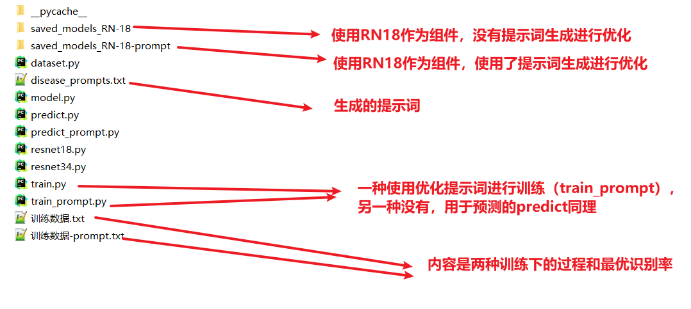

由于整个项目太大（包含了CLIP源码和数据集），所以只上传了实验部分代码，不包含数据集

# 项目目录名称介绍

leaves 表示使用的是PlantVillage数据集

VIT_ResNet_leaves ，VIT_ResNet_mnist，VIT_ResNet_CIFAR（包含10和100），则表示采用混合视觉编码器的改进CLIP模型

# VIT_ResNet_leaves内容介绍

其他数据集的内容也差不多按这种命名方法